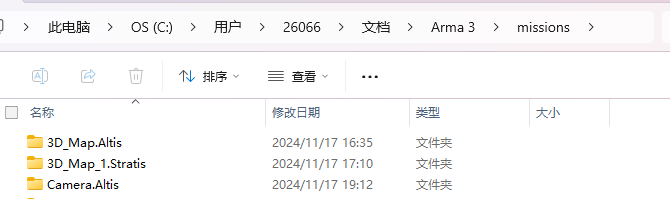

## 启动游戏

修改模块，初启动是没有HITSZ那个模块的。

这个模块里面是Python代码（自己编写的），用于获取游戏内的数据。可以先不管。

- 点击开始游戏后进入游戏界面

## 游戏里的代码修改的存放位置

（windows）

> 比如Camera.Altis  Camera是游戏中的自定义命名文件，Altis是游戏地图。
>
> init.sqf  >  code提供
> mission.sqm > 创建场景的文件

简单解释：在这个文件下写游戏，游戏是怎么样的，完全由你的代码控制

sqm文件可以游戏自动生成。sqf文件由你自己编写。

sqf语言文档：[Scripting Commands – Arma 3 Category - Bohemia Interactive Community](https://community.bistudio.com/wiki/Category:Arma_3:_Scripting_Commands)

入门：[学好SQF, 快活Arma3-CSDN博客](https://blog.csdn.net/qq_35697906/article/details/123844766)

## 进入游戏

> 点击editor

> 使用地图

> 这里是打开，你需要自己创建，创建教程在后面。

> 左边是我们定义的无人机，以及飞行的轨迹。

> 上图是六架无人机的航拍图

## 创建过程

> 保存并命名

- 下面一添加一个无人机为例

通过拖拽完成上述操作。当然也可以在sqf语言里去编写你自己的规则。

## code 

> init.sqf

当你点击`玩游戏场景`,就会执行的文件。

在网盘下载code：

https://drive.google.com/file/d/1u-YessynVPDVaoB6sYyKKiPgFZO8MDM0/view?usp=drive_link

